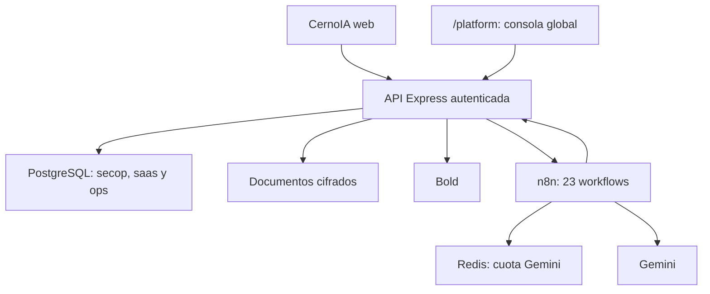

# Implementación integral de CernoIA — puntos 2 a 8

Fecha de corte: 7 de septiembre de 2026.

Este documento describe el estado verificable del producto solicitado: expediente documental, alertas, propuesta/autollenado, firma electrónica, control de IA con Redis, pagos Bold, Chat CernoIA, mapa territorial y operación segura. El código está preparado; la activación en el VPS y las pruebas con servicios reales siguen siendo pasos separados.

## Resultado ejecutivo

| Módulo | Entrega incluida | Estado antes de producción |
|---|---|---|
| Identidad y acceso | Cookie segura, CSRF, sesiones revocables, roles, MFA TOTP, recuperación, invitaciones de un solo uso y onboarding | Código listo; conectar SMTP y probar dos organizaciones |
| Documentos empresariales | Carga privada, antivirus, cifrado, extracción, OCR, revisión y políticas de vigencia | Código listo; instalar/probar ClamAV y OCR |
| Alertas | Agenda configurable, bandeja, correo/WhatsApp verificables, reintentos y DLQ | Código listo; conectar proveedor y activar WF-021/WF-025 |
| Propuestas | Matriz de cumplimiento, plantillas DOCX/PDF, autollenado y paquete PDF | Código listo; cargar/mapping de plantillas reales y activar WF-022 |
| Firma | Trazo o imagen, consentimiento, hash y auditoría por paquete | Firma electrónica simple; no sustituye certificado digital cuando el pliego lo exija |
| IA/Redis | Cupo compartido por minuto/día, espera, denegación y fallback | Código listo; ajustar límites reales de Gemini y probar concurrencia |
| Chat CernoIA | Conversaciones privadas, contexto permitido, citas y agente n8n de una iteración | Código listo; activar WF-023 y prueba anti-inyección |
| Suscripciones | Bold, webhook firmado, idempotencia, 100 fundadores y renovaciones | Código listo; probar con llaves sandbox/reales antes de exigir pago |
| Mapa de contratación | Colombia → departamento → municipio → pagaduría, montos, procesos y tendencia | Código listo; validar calidad/normalización con datos SECOP reales |
| Operación | Centro de salud, reintentos, DLQ, respaldos y restauración protegida | Código listo; programar backup y hacer simulacro de restauración |
| Consola de plataforma | Administrador global separado, organizaciones, estado, cupos y auditoría | Código listo; crear la primera cuenta global en el VPS |

## Arquitectura

El navegador nunca recibe llaves de Bold, Gemini, PostgreSQL o n8n. Toda acción de cliente pasa por la API, la sesión, CSRF, autorización por rol y el filtro de `organization_id`.

## 1. Programa de clientes fundadores

La regla implementada es deliberadamente inequívoca:

- los cupos fundadores se numeran del 1 al 100;
- el cupo se reserva temporalmente al crear el enlace, pero solo queda adquirido con un pago aprobado;
- el precio fundador es COP 250.000 por mes;
- se conserva hasta cumplir 12 ciclos aprobados y nunca más allá de los 12 meses desde la primera activación;
- una empresa no fundadora, o un fundador que ya terminó la protección, paga COP 1.200.000 por mes;
- la selección del cupo usa transacción y bloqueo asesor para evitar vender el mismo cupo dos veces;
- la redirección del navegador no habilita servicios: solo lo hace un evento Bold válido y persistido.

Bold documenta la creación de enlaces cerrados, la autenticación con llave de identidad y la consulta del link en su [API Link de pagos](https://developers.bold.co/pagos-en-linea/api-link-de-pagos). El receptor implementado conserva el cuerpo exacto, verifica `x-bold-signature` con HMAC-SHA256, registra el evento antes de responder e impide reprocesar el mismo ID, de acuerdo con la [guía oficial de webhooks de Bold](https://developers.bold.co/webhook).

Bold no se modela aquí como débito automático. Cada renovación genera un nuevo enlace mensual y la aplicación recuerda al cliente 7, 3, 1 y 0 días antes. Si más adelante Bold habilita un producto recurrente para la cuenta, debe integrarse como un contrato separado y no asumirse desde el flujo de links.

## 2. Chat CernoIA controlado

El frontend incluye un espacio de conversación propio. La API crea hilos y mensajes aislados por organización y envía a WF-023 únicamente:

- identidad interna de organización y usuario;
- pregunta limitada en tamaño;
- historial acotado;
- fuentes SECOP y empresariales autorizadas para la organización.

WF-023 pasa primero por WF-020, usa una sola iteración del agente y exige respuesta estructurada con citas. No se habilitan herramientas generales, comandos, acceso arbitrario a SQL ni lectura de secretos. Si la cuota está agotada, la aplicación conserva la conversación y muestra un estado recuperable en lugar de multiplicar reintentos.

Pruebas mínimas:

1. preguntar por una oportunidad visible y verificar que cite la fuente correcta;
2. intentar solicitar datos de otra empresa y comprobar el rechazo;
3. introducir instrucciones para ignorar reglas y confirmar que no aparecen secretos;
4. agotar el límite horario de conversación y verificar respuesta `429` controlada;
5. agotar la cuota diaria de IA y confirmar el fallback sin bucle.

## 3. Redis y protección de Gemini Free

WF-020 reserva de forma atómica dos contadores en Redis: uno por minuto y otro por día, compartidos por todos los workflows de Gemini. PostgreSQL registra cada concesión, espera o denegación para auditoría.

Redis no sustituye PostgreSQL ni convierte automáticamente n8n en modo cola. Su responsabilidad es evitar que varios workflows crean al mismo tiempo que aún queda cuota. El puerto `6379` debe escuchar solo en localhost, con contraseña y sin publicación en CloudPanel.

Los límites iniciales de `8 RPM` y `400 RPD` son valores conservadores configurables, no una garantía de Google. Antes de activar IA deben reemplazarse por los límites que muestre el proyecto real en Google AI Studio.

## 4. Expediente documental y alertas

El flujo visible permite cargar PDF, DOCX, XLSX e imágenes autorizadas. La API valida extensión y firma binaria, tamaño, duplicado, malware, cifra el archivo con AES-256-GCM y lo almacena fuera de la carpeta pública.

La extracción sigue esta ruta:

1. validar y guardar en estado de procesamiento;
2. ejecutar WF-024 o el extractor local controlado;
3. extraer texto o ejecutar OCR dentro de límites de páginas/píxeles;
4. sugerir tipo documental, fecha de expedición, vencimiento y tipo de proponente;
5. pedir revisión humana cuando falta evidencia o confianza;
6. confirmar valores y aplicar la política documental;
7. materializar alertas en los días configurados.

Las alertas no dependen de Gemini. WF-021 usa IA solo para el resumen; vencimientos, documentos sin fecha y revisiones pendientes existen mediante reglas determinísticas. WF-025 entrega la bandeja por canales verificados y manda fallos reiterados a la DLQ.

## 5. Plantillas, autollenado y firma

La organización puede cargar plantillas DOCX con marcadores o PDF con campos editables, publicar versiones y generar un archivo para una oportunidad. Los valores provienen de datos confirmados de empresa, proceso y usuario; los campos sin respaldo quedan señalados para revisión.

El paquete de propuesta combina:

- datos de la organización y la oportunidad;
- matriz de requisitos y documentos que los soportan;
- contenido redactado conservadoramente;
- lista de faltantes y revisión obligatoria;
- huella del archivo, usuario y fecha de generación.

La firma implementada es **electrónica simple**: trazo o imagen PNG/JPG, consentimiento explícito, usuario autenticado, autorización específica por paquete y huella SHA-256. Nunca debe anunciarse como firma digital certificada. Cuando una entidad exija certificado digital, debe conectarse un proveedor acreditado y conservar su evidencia criptográfica.

La aplicación no presenta ofertas automáticamente en SECOP. La descarga siempre es un borrador revisable.

## 6. Mapa de calor de contratación

El mapa usa geometría vectorial de Colombia y datos agregados del esquema `secop`. Permite navegar:

1. total nacional;
2. departamento;
3. municipio/ciudad/pueblo;
4. pagaduría o entidad contratante.

En cada nivel muestra monto licitado, número de procesos, valor promedio y tendencia temporal. El color usa una escala relativa al conjunto visible; el monto y el periodo se muestran siempre para no inducir conclusiones solo por color.

La calidad del mapa depende de normalizar nombres territoriales. Se incluyeron alias frecuentes para Bogotá, San Andrés, Norte de Santander y Guaviare, pero la aceptación real debe medir:

- porcentaje de procesos sin departamento o municipio;
- entidades con varias grafías/NIT;
- municipios homónimos en departamentos distintos;
- moneda y valores nulos/atípicos;
- diferencia entre valor publicado, adjudicado y ejecutado.

Para una fase posterior conviene añadir comparación por habitante, sector, modalidad, valor adjudicado y concentración de proveedores. Esos indicadores requieren fuentes y definiciones verificadas; no deben mezclarse con el valor licitado actual.

## 7. Seguridad, aislamiento y consola global

Se agregaron:

- cookie `HttpOnly`, `Secure`, `SameSite=Strict`, CSRF y validación de origen;
- sesiones revocables, bloqueo de intentos, cambio/restablecimiento de contraseña;
- MFA TOTP con secreto cifrado y consumo transaccional de códigos;
- roles de propietario, administrador, analista y consulta;
- cifrado de archivos y secretos, antivirus y límites de procesamiento;
- aislamiento explícito por `organization_id` en la API;
- políticas RLS de defensa adicional en tablas SaaS con `organization_id`, usando contexto transaccional;
- `saas.platform_admin_users` y sesiones independientes: el administrador global no es miembro de una empresa;
- invitaciones con token hash, vencimiento de 72 horas y aceptación única; el correo global permanece único para impedir membresías múltiples;
- onboarding persistido (`started`, `profile_incomplete`, `ready`, `blocked`) y panel de preparación en Configuración;
- bandejas durables, reintentos acotados y DLQ;
- scripts de backup con checksums y restauración con confirmación exacta.

Las políticas RLS instaladas no sustituyen los predicados de organización. Antes de usar una cuenta PostgreSQL no propietaria con RLS forzado se debe probar toda la API con el contexto de tenant dentro de transacciones; no se debe activar ese cambio a ciegas. La solución mantiene deliberadamente una persona ligada a una sola organización; no existe selector de empresa.

## 8. Workflows incluidos

El paquete contiene 23 JSON:

- WF-000, inicialización segura, permanece inactivo;
- 12 etapas coordinadas por WF-019;
- WF-007, manejo global de errores;
- WF-011, expediente empresarial;
- WF-020, cuota Gemini/Redis;
- WF-021, alertas y resumen;
- WF-022, paquete de propuesta;
- WF-023, Chat CernoIA;
- WF-024, OCR y revisión;
- WF-025, entrega de notificaciones;
- WF-026, pagos/renovaciones y conciliación.

`npm run audit:workflows` comprueba inventario, conexiones, parámetros SQL, webhooks, control de IA y orden de activación. Los JSON se entregan inactivos para impedir horarios duplicados al importarlos.

## Puerta de salida a producción

No activar `SUBSCRIPTION_ENFORCED=true` ni invitar clientes hasta aprobar todos estos bloques:

### Infraestructura

- respaldo reciente de PostgreSQL y documentos;
- migraciones `000` a `009` aplicadas en una copia o respaldo verificable;
- Node 22 del Site User, PM2, Redis, Poppler y ClamAV saludables;
- DNS/SSL de `agentglobal.online` y Vhost `/api` verificados;
- simulacro de restauración en una base distinta.

### Servicios externos

- Bold en pruebas: link, rechazo, aprobación, duplicado, firma inválida y renovación;
- SMTP/WhatsApp: verificación, entrega, fallo y reintento;
- Gemini: límites reales cargados, concurrencia y cuota agotada;
- n8n: 23 workflows importados, credenciales reconectadas y publicados según manifiesto.

### Producto y aislamiento

- dos organizaciones de prueba sin visibilidad cruzada;
- carga PDF/DOCX/XLSX/imagen, malware simulado y OCR/revisión;
- alertas a 30/15/7/3/1/0 días según política;
- mapa contrastado con consultas SQL del mismo periodo;
- Chat con fuentes, prompt adversarial y cuota agotada;
- plantilla real de una entidad, autollenado, firma y descarga;
- pago fundador #1 y #100, intento #101 y final de los 12 ciclos;
- funcionamiento móvil y accesibilidad de las acciones críticas.

## Mejoras recomendadas después del lanzamiento

Estas mejoras aportan valor, pero no deben retrasar una beta controlada cuando la puerta anterior esté aprobada:

1. onboarding guiado con porcentaje de preparación de la empresa;
2. panel de consumo/costo de IA por organización y workflow;
3. conciliación secundaria de pagos mediante consulta de Bold solo cuando falte el webhook;
4. proveedor colombiano de firma digital certificada como módulo opcional;
5. métricas de conversión: oportunidad vista → preparada → presentada → adjudicada;
6. observabilidad externa, alertas de disponibilidad y objetivos de recuperación medidos;
7. importador asistido de plantillas de entidades con aprobación humana;
8. comparación territorial por población, sector y concentración de contratación.

La prioridad inmediata no es agregar más botones: es completar la aceptación real de los módulos ya incluidos y medirlos con una cohorte pequeña antes de abrir los 100 cupos.
